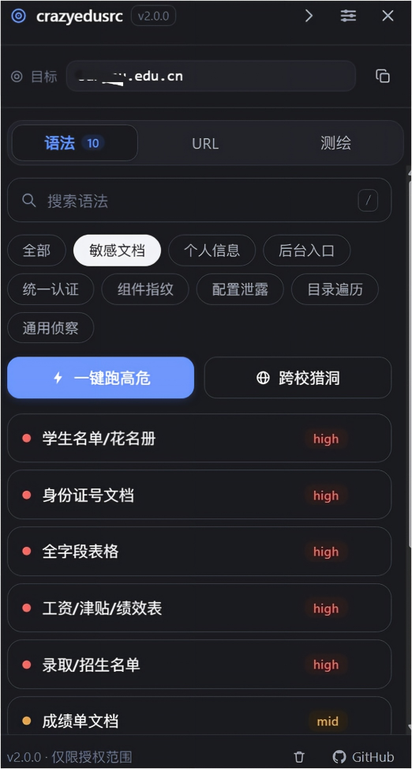
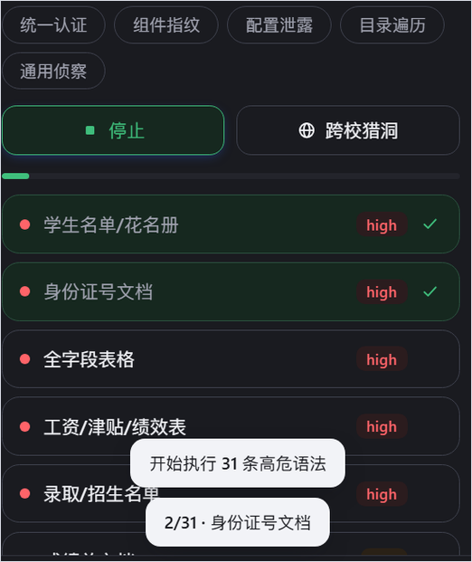
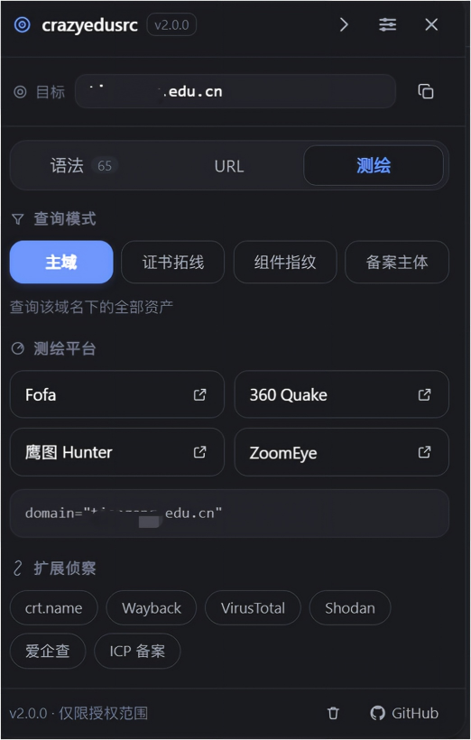
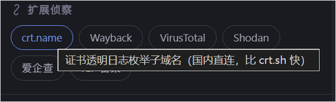
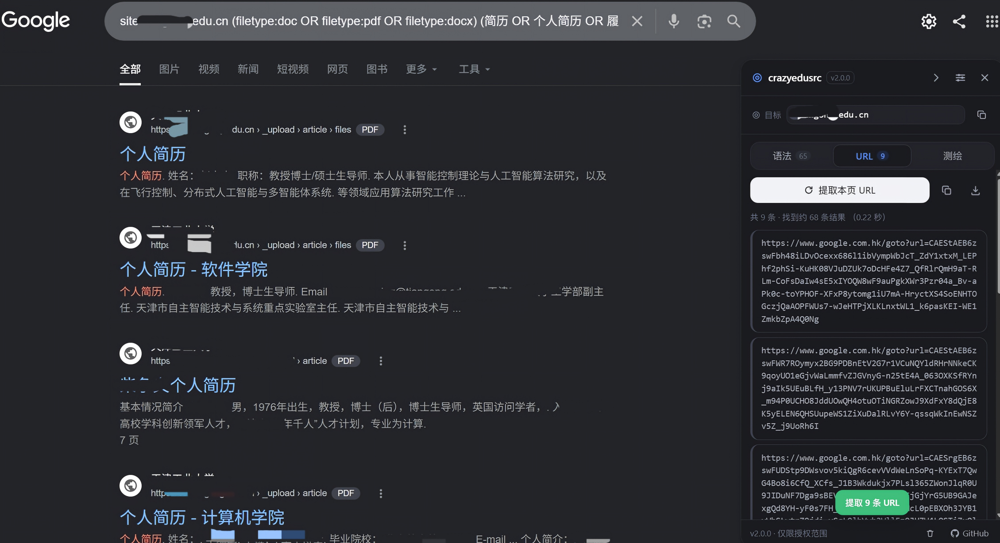

# crazyedusrc v2.0 🎯

**EduSRC 教育行业猎洞工具 —— 基于搜索引擎 Dork 的一键式侦察 Chrome 扩展**


---

## ⚠️ 免责声明

**本工具仅用于 EduSRC 等平台授权范围内的合法安全研究与漏洞挖掘。** 搜索引擎发现目标 ≠ 授权测试。实际验证前请确认目标在平台收录范围内，并遵守《网络安全法》等相关法律法规，使用者对自身行为独立承担责任。

---

## v2.0 相比 v1.0 做了什么

> v2.0 是全量重构版本（开发过程中曾以 v1.1.x 迭代，正式发布统一记为 2.0.0）。

### 🥳新增侧边栏可收起，拖拽功能

### 😺新增语法多条，便于查找敏感信息

### ✨完全修改样式，布局重构

| 优化项 | v1.0 | v2.0 |
|---|---|---|
| 点击语法 | `await` 读存储后再跳转 | 同步构造 URL 直接跳转 |
| 事件绑定 | 每个按钮一个 listener | 面板级事件委托，一个 listener |
| 导航监听 | `document` 全量 `subtree` MutationObserver | 1 秒一次 href 字符串比较 + popstate |
| 样式加载 | 向页面注入 719 行暗色 CSS（176 条 `!important`） | Shadow DOM 内一份 CSS，页面零注入 |
| 元素主题 | 递归给每个子孙节点写 `data-theme` | 根节点一个属性 + CSS 变量 |
| 面板定位 | 强改 Google `#rhs` / 百度 `#content_right` / Bing `#b_content` | 独立 `position:fixed` 宿主 + 可拖拽 |

### 修掉的 Bug（v1.0）

1. **选项页保存会丢掉 4 个新设置项** —— `saveSettings()` 整体替换对象却没带新字段；v2.0 所有控件即时保存且写入前先读最新值合并，结构上不可能再丢

2. **`sensitiveHighlightEnabled` 是死设置** —— 定义了却从未被读取；现已生效并补齐 UI

3. **侧边栏图标全是空白** —— 用了 Font Awesome 但没向内容脚本注入；v2.0 改为内联 SVG，零外部字体依赖

4. **复制 URL 后敏感标签永久消失** —— 恢复时只写回文本；v2.0 重建完整结构

5. **`site:` 域名未清洗** —— `site:"pku.edu.cn"` / `site:*.pku.edu.cn` / 带路径端口都会把脏数据拼进测绘查询；v2.0 统一 `cleanDomain()`

   

## ✨ 功能

### 🎯 教育行业专用语法库（60+ 条）

按 8 类攻击面组织，全部支持 `{target_domain}` 占位符：

| 分类 | 覆盖内容 |
|---|---|
| 敏感文档 | 学生名单 / 花名册、身份证号文档、全字段表格、**工资津贴表**、录取名单、成绩单、奖助学金、教职工信息、党员信息、论文 |
| 个人信息 | 身份证+手机号关键词、学籍异动、**心理咨询记录**、简历泄露、试题答案、**文档内口令** |
| 后台入口 | 管理后台、OA、一卡通、图书馆、宿舍后勤、缴费财务、**教务处后台**、监控门禁、实验室管理 |
| 统一认证 | CAS、办事大厅、WebVPN、**深信服 VPN 指纹**、SSO 门户、邮箱、微信入口 |
| 组件指纹 | 正方（新版 jwglxt / 旧版）、强智、青果、招生就业、Nacos、Druid、Swagger、**Spring Boot 端点**、Jenkins、phpMyAdmin、UEditor、**泛微 / 致远 / 通达 OA**、**用友 NC** |
| 配置泄露 | 数据库备份、网站备份、`.env`/config、`.git`/`.svn`、日志、容器/K8s 配置、**数据库连接串** |
| 目录遍历 | 开放目录、上传目录、备份目录、索引中的表格 |
| 通用侦察 | 报错泄露、测试/旧系统、弱口令、上传接口、论坛、API 文档 |

### 🛰️ 资产测绘四档联动

| 模式 | Fofa | Quake | Hunter | ZoomEye | 用途 |
|---|---|---|---|---|---|
| 主域 | `domain="x"` | `domain:"x"` | `domain.suffix="x"` | `site:"x"` | 基线资产 |
| **证书拓线** | `cert="x"` | `cert:"x"` | `cert="x"` | `ssl:"x"` | **找同证书的旁站与隐藏域名** |
| 组件指纹 | `domain="x" && (title="k" \|\| body="k")` | 同左 | 同左 | 同左 | 直接定位爆洞组件 |
| 备案主体 | `icp="k"` | — | — | `icp:"k"` | 按单位名找全部备案域名 |

外加 6 个侦察入口：crt.name（证书透明枚举子域，国内直连）、Wayback（历史快照找回下线系统）、VirusTotal、Shodan、爱企查、ICP 备案。面板实时显示生成的查询语句。

### ⚡ 队列式「一键跑高危」

v1.0 是 `slice(0, limit)` 直接丢掉剩余语法，且无延迟连开标签页，极易触发搜索引擎人机验证。v2.0 改为：

- 全部高危语法入队，按「每批 N 个」推进
- 标签页之间随机抖动延迟（默认 1200ms），批与批之间再额外等待
- 实时进度条 + 「停止」按钮
- 每执行一条即打上「已执行」标记

### 🔦 敏感 URL 分级高亮

10 类特征按危险程度分三级着色：

- **critical**（红）：数据库 / 备份 / 配置 / 版本控制
- **warn**（橙）：后台 / 接口调试 / 上传点
- **info**（青）：学生数据 / 证件信息 / 文档

敏感项自动排到列表最前，可一键导出 CSV（含 URL、等级、命中标签）。

### ⭐ 其他

- 语法实时搜索（面板内按 `/` 聚焦）、分类筛选
- **「已执行」跨会话记录**：知道这个学校跑到哪了，悬浮球上显示进度
- 语法库导入 / 导出 JSON（便于团队共享），导入内容强校验
- 跨校猎洞：对全量 `edu.cn` 资产执行 9 类高危语法
- 面板可拖拽、位置记忆、收起为悬浮球
- 快捷键：`Alt+Shift+S` 面板、`Alt+Shift+R` 跑高危、`Alt+Shift+U` 提取 URL、`/` 搜索、`Esc` 收起
- URL 黑名单（域名 / 通配符 / 正则）
- 明暗双主题 + 跟随系统
- 数据全部本地存储，零上传、零追踪

---

## 🚀 安装

```bash
cd crazyedusrc-v2.0
npm install          # 首次
npm run build        # 产物在 dist/
```

1. 打开 Chrome → `chrome://extensions/`
2. 开启右上角**开发者模式**
3. 点**加载已解压的扩展程序**，选择 `dist/` 目录

开发模式：`npm run dev`（watch 重新构建）；类型检查：`npm run typecheck`。

## 🔧 开发与更新

改完代码后，把改动同步到 GitHub 只有三步（项目里放了 `push-github.bat`，**双击它就能自动完成下面全部步骤**）：

```bash
npm run build                                # 1. 重新构建到 dist/
git add . && git commit -m "这次改了什么"      # 2. 记录改动
git push                                     # 3. 上传（首次会弹出浏览器登录 GitHub）
```

推完之后，去 `chrome://extensions/` 点扩展卡片上的 **⟳ 刷新**，Chrome 才会用上新代码。

> `node_modules/` 与 `dist/` 已在 `.gitignore` 中排除，不要提交它们。
> 详细的新手教程见仓库外的《如何更新到 GitHub · 新手版》。

## 📖 使用

1. 在 Google / 百度 / Bing 执行 `site:目标学校.edu.cn`，面板自动出现
2. 「语法」页按攻击面逐类排查，点一条就跳一次搜索
3. 「URL」页提取当前结果页链接，红色标记的高危项优先核验
4. 「测绘」页用**证书拓线**找主域之外的边缘资产，用**组件指纹**直接定位爆洞系统
5. 没搜 `site:` 时按 `Alt+Shift+S` 手动唤起，在目标栏手填域名

> 💡 百度对 edu.cn 中文文档收录更好；Google/Bing 支持 `intitle:` `inurl:` `filetype:`。证书拓线（`cert`）是发现高校边缘资产最有效的一档，建议每所学校都跑一次。

---

## 📸 界面预览

均为 v2.0.0 实机截图（深色为面板自带的深色模式，与页面主题互不影响）。

| 工具总体布局 | 一键跑高危：挨个执行，不引发浏览器流量异常 |
| :---: | :---: |
|  |  |
| **支持测绘功能**：主域 / 证书拓线 / 组件指纹 / 备案主体 | **扩展侦察入口**：crt.name、Wayback、VirusTotal、Shodan、爱企查、ICP 备案 |
|  |  |

### 一键提取页面 URL



在百度 / Google / Bing 的结果页，面板会自动停靠在右侧；切到「URL」标签页点「提取本页 URL」，
即可把当页所有结果链接抓下来，敏感目标按危险等级着色，支持复制全部与导出 CSV。
抓不到时面板会给出诊断计数（扫描多少条、被谁过滤掉多少），并提供「强制全页扫描」兜底。

---

## 🏗️ 目录结构

```
docs/                           # README 界面截图（不打包进扩展）
src/
├── background/index.ts         # Service Worker：初始化存储 / 代开标签页 / 转发快捷键
├── content/index.ts            # 内容脚本：引擎识别、挂载策略、轻量导航监听
├── core/
│   ├── engine.ts               # 三引擎自适应配置 + 域名提取与清洗
│   ├── panel.ts                # 面板控制器（Shadow DOM、渲染、事件委托）
│   └── batch.ts                # 队列式批量执行器（分批 + 抖动延迟 + 暂停/停止）
├── services/
│   ├── state.ts                # 内存状态（设置/语法/记录），点击零等待的根基
│   ├── storage.ts              # chrome.storage 封装 + 合并式读写
│   ├── dorkLibrary.ts          # 内置语法与用户数据合并策略
│   ├── syntax.ts               # 筛选、搜索、模板填充、导入导出、转义
│   ├── sensitive.ts            # 敏感特征分级规则
│   ├── urlExtractor.ts         # URL 提取与规范化（百度 mu / Bing 跳转 / 去跟踪参数）
│   └── assetSearch.ts          # 测绘平台声明式配置（4 平台 × 4 模式 + 6 个扩展入口）
├── ui/                         # 内联 SVG 图标、Toast、图标注入
├── constants/                  # 语法库、选择器、默认设置
└── styles/                     # panel.css（面板）、pages.css（设置页/弹窗）
```

技术栈：TypeScript 5 · Chrome Extension MV3 · Webpack 5 · 零运行时依赖。

## 📄 License

[MIT](LICENSE) © dollmarker

## 🙏 致谢

基于开源项目 [google-hacking-assistant](https://github.com/Pa55w0rd/google-hacking-assistant) 二次开发。
